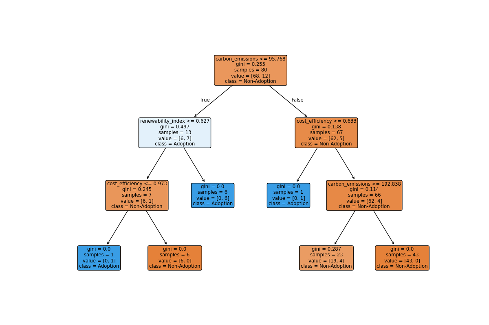
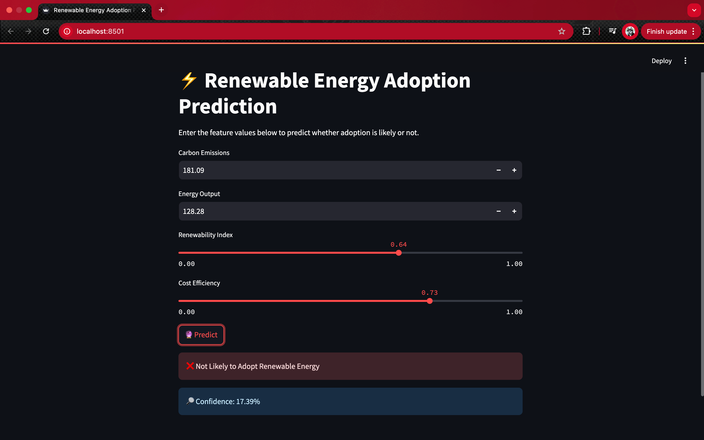

# 🌱 Renewable Energy Adoption Prediction ⚡

This project predicts whether **renewable energy** will be adopted based on various features such as carbon emissions, cost efficiency, and renewability index.  
It uses a **Decision Tree Classifier** built with Scikit-Learn, and an interactive **Streamlit web app** for real-time predictions.

---

## 📂 Project Structure
Renewable-Energy-Adoption/

│── app.py # Streamlit web app

│── Renewable_Energy_Adoption.ipynb # Jupyter Notebook (EDA + Model Training)

│── Renewable_Energy_Adoption.csv # Dataset

│── Renewable_Energy_Adoption_model.pkl # Trained ML model

│── requirements.txt # Dependencies

│── dt1.png # Decision Tree visualization

## 🚀 Installation & Setup

### 1️⃣ Clone the repository
```bash
git clone https://github.com/BhaveshSuthar1511/Renewable-Energy-Adoption.git
cd Renewable-Energy-Adoption
```
### 2️⃣ Create a virtual environment (recommended)
```bash
python -m venv venv
source venv/bin/activate   # On Mac/Linux
venv\Scripts\activate      # On Windows
```
### 3️⃣ Install dependencies
```bash
pip install -r requirements.txt
```


### ▶️ Run the Streamlit App
```
streamlit run app.py
This will launch a local web app in your browser (default: http://localhost:8501).
```
### 📊 Model Overview
```
Algorithm: Decision Tree Classifier 🌳
```

```
Libraries Used: Scikit-Learn, Pandas, Matplotlib, Streamlit
Dataset: Renewable Energy Adoption dataset (Renewable_Energy_Adoption.csv)
Decision Tree Visualization:

📌 Requirements
Python 3.8+
Streamlit
Pandas
Scikit-Learn
Matplotlib

🌟 Features

Interactive web interface with Streamlit
Predict renewable energy adoption based on inputs
Visualize the decision tree
Easy-to-deploy ML model (.pkl file included)
```
## 🖼️ Screenshot
Here is how the app looks when running:




